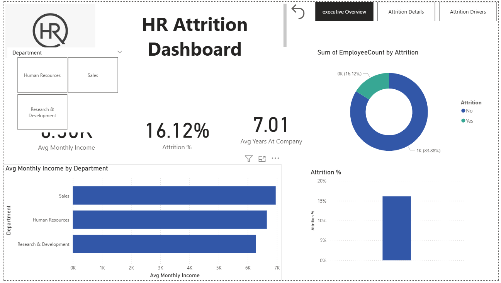
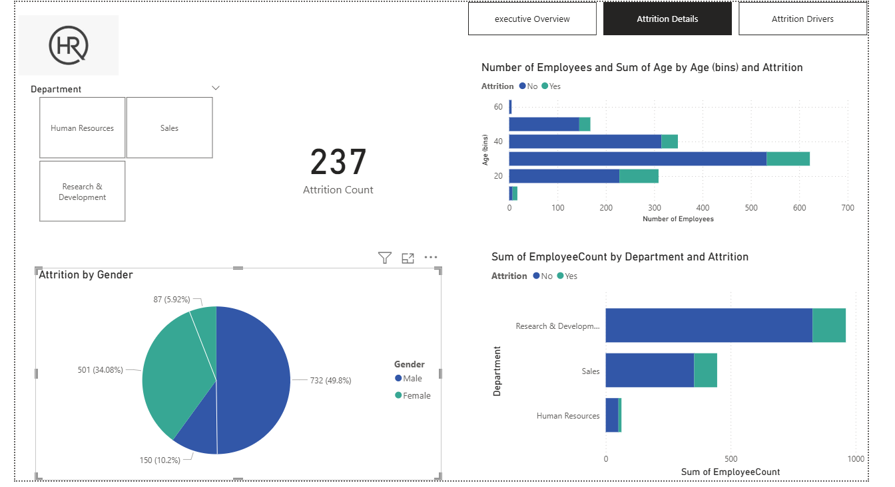

# HR Attrition Analysis Dashboard
### Power BI Portfolio Project | IBM HR Analytics Dataset | 2026

---

## 📈 Project Objective

This HR Analytics dashboard transforms raw workforce data into 
actionable intelligence. The core goal was to identify **predictive 
indicators of employee turnover** and provide HR leadership with a 
visual tool to prioritize retention strategies for high-risk roles, 
salary bands, and departments.

---

## 🛠️ Technical Stack & Skills

| Area | Details |
|---|---|
| **Tool** | Power BI Desktop |
| **Data Source** | IBM HR Analytics Dataset (1,470 employees, 35 features) |
| **Data Transformation** | Power Query (M Language) — null handling, type normalization, calculated columns |
| **Analytical Modeling** | Custom DAX measures — KPI generation, attrition rate calculations, salary band segmentation |
| **Design Approach** | Storytelling with Data — Executive Summary → Drill-down Details → Driver Correlation → Key Insights |

---

## 🚀 Key Analytical Findings

Four critical levers for retention were identified:

1. **Overtime Impact** — Employees working overtime show a 
   **30.53% attrition rate** vs 10.44% for non-overtime staff, 
   signaling a work-life balance crisis
2. **Age Vulnerability** — The 18–25 bracket shows an attrition 
   rate of **34.8%**, indicating an onboarding or growth gap
3. **Compensation Gap** — Low earners (≤$5K/month) have a 
   **21.76% attrition rate** vs only **8.90%** for high earners 
   (>$10K/month), confirming salary as a primary friction point
4. **Role-Specific Risk** — Sales Representatives are the most 
   volatile segment with an attrition rate of **39.8%**

---

## 📊 Dashboard Pages

### Page 1 — Executive Overview
High-level KPIs: total headcount, average income, attrition %, 
average tenure. Department income comparison and overall 
attrition donut chart.


### Page 2 — Attrition Details
Deep dive into attrition by gender, age group, and department. 
Includes attrition count (237) and department-level breakdown.


### Page 3 — Attrition Drivers
Correlation analysis across business travel, overtime, job role, 
job satisfaction, and age bins. Identifies behavioral and 
structural drivers of turnover.


### Page 4 — HR Key Insights & Salary Analysis
Salary band segmentation, job level income analysis, work-life 
balance impact, and years since last promotion effect on attrition. 
Includes three KPI cards: Overtime Risk Index, High Earner 
Attrition %, and Low Earner Attrition %.


---

## 📂 Repository Structure
```
hr-attrition-dashboard/
│
├── dataset/
│   └── WA_Fn-UseC_-HR-Employee-Attrition.csv
│
├── reports/
│   └── HR_Attrition_Analysis_2026.pbix
│
├── images/
│   ├── overview.png
│   ├── details.png
│   ├── drivers.png
│   └── keyinsights.png
│
├── docs/
│   └── DAX_measures.md
│
└── README.md
```

---

## 🧮 DAX Measures Used

| Measure | Formula Logic |
|---|---|
| `Attrition %` | Attrition Count / Total Employees × 100 |
| `OvertimeRiskIndex` | Attrition among overtime workers / All overtime workers × 100 |
| `HighEarnerAttrition` | Attrition among >$10K earners / All >$10K earners × 100 |
| `LowEarnerAttrition` | Attrition among ≤$5K earners / All ≤$5K earners × 100 |
| `SalaryBand` | Calculated column — 4 bands from Low to Very High |

---

## 👨‍💻 Connect & Collaborate

Currently seeking opportunities in **Data Analytics and Business 
Intelligence**. Open to feedback on data modeling approach or 
project structure!

| Platform | Link |
|---|---|
| 💼 LinkedIn | [Sachu Mon Puthenpuraickkal Sajeev](https://www.linkedin.com/in/sachu-mon) |
| 🐙 GitHub | [sachumonpsajeev-cyber](https://github.com/sachumonpsajeev-cyber) |
| 📧 Email | sachumonsajeevp3110@gmail.com |
| 💬 WhatsApp | +371-22447242 |

---

*Built with Power BI Desktop · IBM HR Analytics Dataset · 2026*
